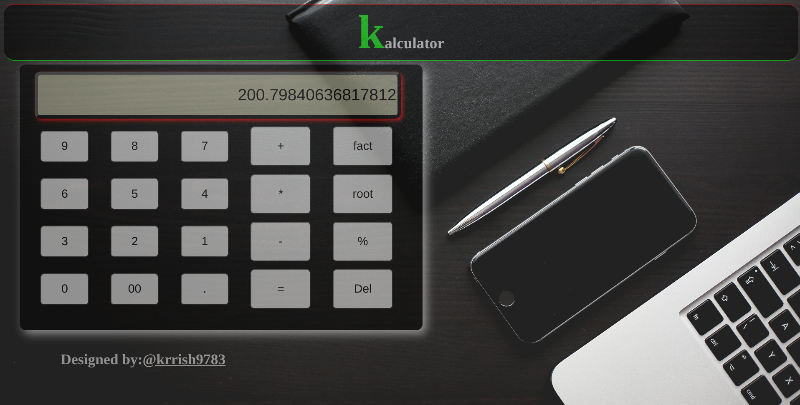
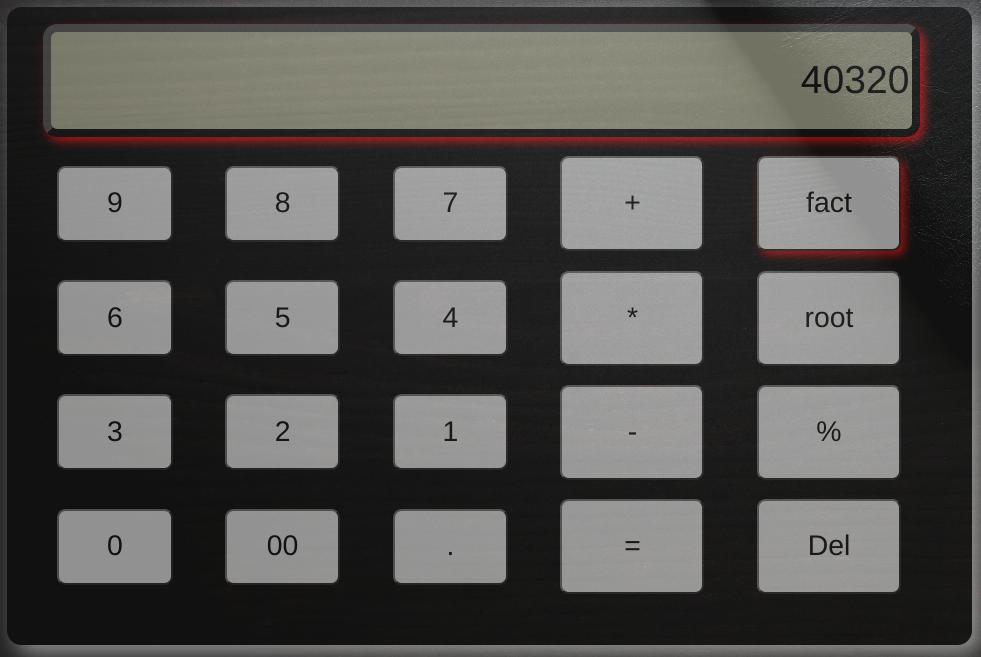

# Pro_calculator
# Kalculator - A Web-Based Calculator

Kalculator is a web-based calculator that provides a realistic and interactive calculator experience. It offers essential arithmetic operations, percentage calculation, factorial, square root, and an engaging design with sound effects.




## Features

- Addition (+)
- Subtraction (-)
- Multiplication (*)
- Division (%)
- Factorial (!)
- Square Root (√)
- Realistic design
- Sound effects

## Demo

Check out the live demo of Kalculator [here](https://kk.com).

## Getting Started

To run Kalculator locally, follow these steps:

1. Clone the repository:
   ```bash
   git clone https://github.com/krrish9783/Pro_Calculator.git
Open the index.html file in your web browser.
Usage
Simply click the buttons or use your keyboard to input numbers and perform calculations. Kalculator provides instant results with a realistic calculator-like interface.

Developer
Developer Name: Kishnu Yadav
Contact: kishnuyadav783@gmail.com
Contributing
If you'd like to contribute to Kalculator, please open an issue or submit a pull request. We welcome contributions from the community.

License
This project is licensed under the MIT License.

Acknowledgments
Special thanks to myself Inspiration Web for inspiration and design ideas.
Sound effects by [pixabay](https://pixabay.com/)
